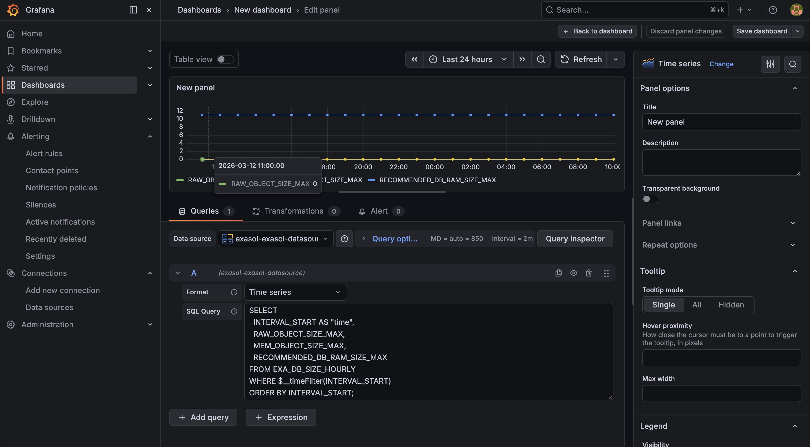

# Exasol Datasource for Grafana

[](https://github.com/exasol-labs/grafana-datasource/actions/workflows/ci.yml)
[](./LICENSE)
[](https://github.com/exasol-labs/grafana-datasource/releases)

Query Exasol directly from Grafana with native SQL — including Grafana time macros, time-series pivoting, alerting, and annotations.



---

## Install

> **Catalog submission is in progress.** Until the plugin is published, install it as an unsigned local plugin (see [DEVELOPMENT.md](./DEVELOPMENT.md#run-grafana-with-the-plugin-in-docker)).

Once published it will be installable from inside Grafana:

1. Open **Connections → Add new connection**.
2. Search for **Exasol** and click **Install**.
3. Click **Add new data source** when the install completes.

## Configure

In **Connections → Data sources → Add data source → Exasol**:

| Field | Notes |
| --- | --- |
| **Host** | Hostname or IP of the Exasol cluster |
| **Port** | Defaults to `8563` |
| **User** | Exasol login |
| **Password** | Stored encrypted by Grafana |
| **Schema** | Optional default schema for the session |
| **Skip TLS verify** | Disable certificate validation. **Test environments only.** |
| **Cert fingerprint** | Optional SHA-256 fingerprint to pin the server certificate. Recommended for self-signed clusters instead of disabling TLS entirely. |
| **Max open conns** | Connection pool ceiling (default `10`) |
| **Max idle conns** | Idle connections to keep around (default `5`) |
| **Conn max lifetime (s)** | Recycle connections older than this (default `14400`) |
| **Query timeout (s)** | Per-query timeout (default `60`) |

Click **Save & test** to verify connectivity.

## Query

Each panel query has a **Format** selector and a SQL editor.

### Table format

Returns raw, typed columns. Use this when you want to render a table panel, populate a stat panel, or feed downstream Grafana transformations.

```sql
SELECT
  USER_NAME,
  USER_PRIORITY,
  CREATED
FROM EXA_ALL_USERS
ORDER BY CREATED DESC
LIMIT 100
```

### Time series format

Returns a wide-format frame with a time field plus one value field per series. The plugin auto-pivots: any non-time/non-numeric columns become **labels** that distinguish series.

```sql
SELECT
  $__timeGroupAlias(MEASURE_TIME, '5m'),
  AVG(USERS_AVG) AS users_avg,
  MAX(USERS_MAX) AS users_max,
  CLUSTER_NAME
FROM EXA_USAGE_HOURLY
WHERE $__timeFilter(MEASURE_TIME)
GROUP BY 1, CLUSTER_NAME
ORDER BY 1
```

Constraints:

- The time column must be a native Exasol `DATE` / `TIMESTAMP`, or an alias produced by `$__time*` / `$__timeGroup*` / `$__unixEpochGroup`.
- Queries must return at least one time column and one numeric column.
- Series order is deterministic across runs (sorted by label key).

## Macros

| Macro | Expands to | Notes |
| --- | --- | --- |
| `$__time(col)` | `<col> AS "time"` | Aliases a native temporal column |
| `$__timeFilter(col)` | `<col> >= <from> AND <col> <= <to>` | Time-range predicate using the panel's range |
| `$__timeFrom()`, `$__timeTo()` | Range bounds | Optional column arg adds comparison operator |
| `$__timeGroup(col, interval [, fill])` | Bucketing expression | Fixed: `ms/s/m/h/d/w`. Calendar: `1M`, `1y` |
| `$__timeGroupAlias(col, interval [, fill])` | Same as `$__timeGroup` + `AS "time"` | Use in `SELECT` for time-series panels |
| `$__interval`, `$__interval_ms` | Panel/alert interval | Defaults to `1s` / `1000` when no interval is supplied |
| `$__unixEpochFilter(col)` | `<col> >= <fromSec> AND <col> <= <toSec>` | For columns storing Unix epoch as `DECIMAL` / `INTEGER` |
| `$__unixEpochGroup(col, interval)` | `FLOOR(<col> / N) * N` | Numeric epoch bucketing; minimum 1-second buckets |

For a richer set of example queries, see [`docs/examples.sql`](./docs/examples.sql).

## Alerting

Backend alerting is supported. Grafana resolves dashboard template variables before the query reaches the plugin; macros (`$__time*`, `$__interval*`, `$__unixEpoch*`) are then expanded server-side using the alert's evaluation window.

Tips:

- Use `$__timeFilter` (not literal timestamps) so the alert always evaluates against the rolling window.
- For aggregated alerts, use `$__interval_ms` to make the GROUP BY bucket size scale with the alert frequency.
- `$__time(col)` aliases the time column as `"time"`, which Grafana's alert engine prefers.

## Annotations

Annotation queries are supported via the standard query editor. Return rows with a temporal column plus `text` and/or `tags` aliases:

```sql
SELECT
  $__time(MEASURE_TIME),
  EVENT_TYPE AS text,
  CLUSTER_NAME AS tags
FROM EXA_SYSTEM_EVENTS
WHERE $__timeFilter(MEASURE_TIME)
ORDER BY MEASURE_TIME
```

## Plugin signing

This repository builds an unsigned plugin out of the box. Catalog distribution requires a Grafana access policy token; see [DEVELOPMENT.md](./DEVELOPMENT.md#releasing).

## Support

- File bugs and feature requests on the [issue tracker](https://github.com/exasol-labs/grafana-datasource/issues).
- Security disclosures: see [SECURITY.md](./SECURITY.md).
- Contributing: see [CONTRIBUTING.md](./CONTRIBUTING.md).

## License

[MIT](./LICENSE). See [DISCLAIMER.md](./DISCLAIMER.md) for the project's warranty and support stance.
